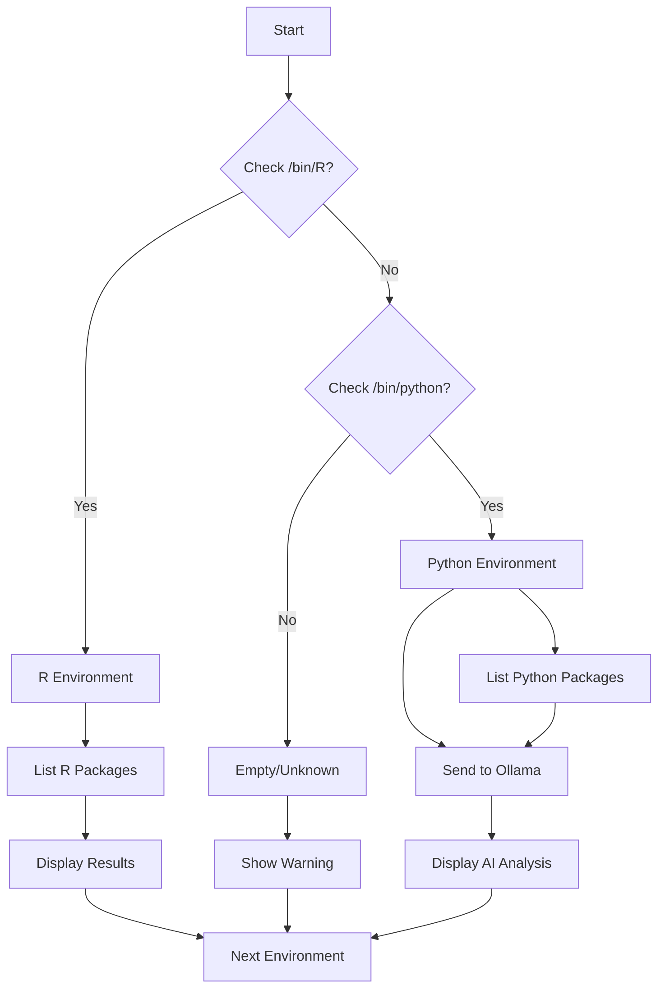

# 🧠 Conda Environment AI Analyzer

A powerful Bash script that analyzes your Conda/Miniconda environments using **local AI (Ollama)** to provide intelligent insights about each environment's purpose, tools, and recommended use cases.

---

## 📋 Table of Contents

- [Features](#-features)
- [Prerequisites](#-prerequisites)
- [Installation](#-installation)
- [Usage](#-usage)
- [Configuration](#-configuration)
- [How It Works](#-how-it-works)
- [Example Output](#-example-output)
- [Troubleshooting](#-troubleshooting)
- [FAQ](#-faq)
- [License](#-license)

---

## ✨ Features

| Feature | Description |
|---------|-------------|
| 🤖 **AI-Powered Analysis** | Uses Ollama (local LLM) to analyze packages and determine environment purpose |
| 🐍 **Python Support** | Detects Python version, packages, and provides intelligent recommendations |
| 📊 **R Support** | Automatically detects R environments and lists R packages |
| 🎯 **Smart Detection** | Identifies environment type (Data Science, Web Dev, ML, etc.) |
| 🔒 **Privacy-First** | All analysis runs locally - no data sent to external APIs |
| 📊 **Visual Output** | Color-coded terminal output with clear categorization |
| ⚡ **Fast & Lightweight** | Pure Bash script with minimal dependencies |
| 🔧 **Auto-Detection** | Automatically finds Conda environments and their paths |

---

## 📦 Prerequisites

### Required Software

| Software | Version | Installation |
|----------|---------|--------------|
| **Bash** | 4.0+ | Pre-installed on most Linux/Mac |
| **Conda/Miniconda** | Any | [Download](https://docs.conda.io/en/latest/miniconda.html) |
| **Ollama** | Latest | [Download](https://ollama.com) |
| **jq** | Latest | `sudo apt install jq` (Ubuntu/Debian) |
| **curl** | Latest | Pre-installed on most systems |

### Required Ollama Model

At least one Ollama model must be downloaded:

```bash
# Recommended (balanced speed/quality)
ollama pull mistral:latest

# Alternative (faster, smaller)
ollama pull llama3.2:3b

# Alternative (higher quality, slower)
ollama pull qwen2.5:14b
```

### Verify Installation

```bash
# Check Conda
conda --version

# Check Ollama
ollama --version

# Check jq
jq --version

# Check Ollama API
curl http://localhost:11434/api/tags
```

---

## 🚀 Installation

### Step 1: Clone or Download

```bash
# Option A: Clone from GitHub
git clone https://github.com/YOUR_USERNAME/conda-ai-analyzer.git
cd conda-ai-analyzer

# Option B: Download directly
curl -O https://raw.githubusercontent.com/YOUR_USERNAME/conda-ai-analyzer/main/conda_ai_analyzer.sh
```

### Step 2: Make Executable

```bash
chmod +x conda_ai_analyzer.sh
```

### Step 3: Verify Ollama is Running

```bash
# Start Ollama server (if not already running)
ollama serve

# In a new terminal, verify it's working
curl http://localhost:11434/api/tags
```

### Step 4: Run the Script

```bash
./conda_ai_analyzer.sh
```

---

## 📖 Usage

### Basic Usage

```bash
# Run with default settings
./conda_ai_analyzer.sh

# Run with debug mode (see technical details)
DEBUG=true ./conda_ai_analyzer.sh
```

### Command Options

| Option | Description | Example |
|--------|-------------|---------|
| `DEBUG=true` | Enable verbose logging | `DEBUG=true ./conda_ai_analyzer.sh` |
| `MODEL=name` | Override default model | `MODEL="llama3.2:3b" ./conda_ai_analyzer.sh` |

### Integration with Shell

Add an alias to your `~/.bashrc` or `~/.zshrc`:

```bash
alias conda-analyze='~/path/to/conda_ai_analyzer.sh'
```

Then simply run:
```bash
conda-analyze
```

---

## ⚙️ Configuration

Edit the top section of the script to customize behavior:

```bash
# ============================================
# CONFIGURATION
# ============================================
OLLAMA_API="http://localhost:11434/api/generate"  # Ollama API endpoint
MODEL="mistral:latest"                              # LLM model to use
DEBUG=false                                         # Enable debug logging
# ============================================
```

### Configuration Options

| Variable | Default | Description |
|----------|---------|-------------|
| `OLLAMA_API` | `http://localhost:11434/api/generate` | Ollama API endpoint URL |
| `MODEL` | `mistral:latest` | Ollama model for analysis |
| `DEBUG` | `false` | Enable verbose debug output |

### Recommended Models

| Model | Size | Speed | Quality | Best For |
|-------|------|-------|---------|----------|
| `llama3.2:3b` | 3B | ⚡⚡⚡ | ⭐⭐ | Quick analysis |
| `mistral:latest` | 7B | ⚡⚡ | ⭐⭐⭐ | **Recommended** |
| `qwen2.5:14b` | 14B | ⚡ | ⭐⭐⭐⭐ | Detailed analysis |
| `llama3:8b` | 8B | ⚡⚡ | ⭐⭐⭐ | Balanced |

---

## 🔧 How It Works

### Architecture Overview

```
┌─────────────────────────────────────────────────────────────┐
│                    conda_ai_analyzer.sh                      │
├─────────────────────────────────────────────────────────────┤
│  1. Environment Discovery                                    │
│     └─> conda info --envs                                    │
│                                                              │
│  2. Environment Analysis                                     │
│     ├─> Detect Python/R bin                                  │
│     ├─> Extract package list (pip/conda)                     │
│     └─> Filter common packages (noise reduction)             │
│                                                              │
│  3. AI Processing (Ollama)                                   │
│     ├─> Build JSON prompt                                    │
│     ├─> Send to Ollama API                                   │
│     └─> Parse response with jq                               │
│                                                              │
│  4. Output Generation                                        │
│     └─> Color-coded terminal display                         │
└─────────────────────────────────────────────────────────────┘
```

### Environment Detection Flow



### Package Filtering

The script filters out common packages to reduce noise and focus on meaningful dependencies:

```bash
# Filtered packages (examples)
pip, setuptools, wheel, certifi, idna, urllib3, packaging,
typing, markupsafe, jinja2, click, pyyaml, numpy, pandas, etc.
```

This ensures the AI focuses on **domain-specific packages** like:
- `torch`, `tensorflow` → Machine Learning
- `django`, `flask` → Web Development
- `plotly`, `matplotlib` → Data Visualization
- `sqlalchemy`, `psycopg2` → Database

---

## 📊 Example Output

```
========================================
   ANALIZADOR INTELIGENTE DE ENTORNOS   
========================================

🔍 Verificando Ollama...
✅ Ollama OK | Modelo: mistral:latest

----------------------------------------
Entorno: bigquery
📍 Tipo: Entorno Python
Python: 3.10.15
Paquetes: 20
🤖 Analizando...
PROPÓSITO: Google Cloud Data Processing and Analytics
HERRAMIENTAS: pandas (data manipulation), google-cloud-bigquery (cloud DB), 
             pyarrow (data formats), db-dtypes (database types)
DIFERENCIADOR: Configurado específicamente para BigQuery con drivers de Google Cloud
USAR_PARA: Cuando necesites conectar y consultar BigQuery desde Python

----------------------------------------
Entorno: django
📍 Tipo: Entorno Python
Python: 3.10.12
Paquetes: 15
🤖 Analizando...
PROPÓSITO: Web Application Development with Django Framework
HERRAMIENTAS: django (web framework), djangorestframework (API), 
             celery (task queue), psycopg2 (PostgreSQL)
DIFERENCIADOR: Incluye Celery para tareas asíncronas y DRF para APIs
USAR_PARA: Desarrollo y despliegue de aplicaciones web Django

----------------------------------------
Entorno: Rstudio
📍 Tipo: Entorno R
Paquetes R:
   - ggplot2
   - dplyr
   - tidyr
   - readr
   - shiny
💡 Nota: Entorno R puro.

----------------------------------------
Entorno: langchain-env
📍 Tipo: Entorno Python
Python: 3.11.14
Paquetes: 25
🤖 Analizando...
PROPÓSITO: LLM Orchestration and RAG Applications
HERRAMIENTAS: langchain (LLM orchestration), chromadb (vector DB), 
             openai (API access), tiktoken (tokenization)
DIFERENCIADOR: Configurado para RAG con base de datos vectorial
USAR_PARA: Cuando desarrolles aplicaciones con LLMs y retrieval

========================================
Resumen: 25/26 entornos analizados
========================================
```

---

## 🐛 Troubleshooting

### Common Issues

| Problem | Solution |
|---------|----------|
| `❌ Modelo no encontrado` | Run `ollama pull mistral:latest` |
| `❌ jq no instalado` | Run `sudo apt install jq` |
| `Connection refused` | Start Ollama: `ollama serve` |
| `⚠️ Entorno vacío` | Environment may be corrupt. Run `conda list -n <name>` |
| `⚠️ Sin análisis de IA` | Check Ollama logs, try smaller model |
| Script timeout | Reduce packages: change `head -n 20` to `head -n 10` |

### Debug Mode

Enable debug mode to see technical details:

```bash
DEBUG=true ./conda_ai_analyzer.sh
```

This shows:
- Environment paths detected
- Binary locations (Python, R, pip)
- Raw API requests/responses
- Package lists sent to AI

### Ollama API Issues

```bash
# Test Ollama connection
curl http://localhost:11434/api/tags

# Test generation
curl -X POST http://localhost:11434/api/generate \
  -H "Content-Type: application/json" \
  -d '{"model": "mistral:latest", "prompt": "hello", "stream": false}'

# Check Ollama logs
docker logs ollama  # If running in Docker
journalctl -u ollama  # If running as service
```

### Conda Environment Issues

```bash
# List all environments
conda info --envs

# Check specific environment
conda list -n <env_name>

# Remove corrupt environment
conda remove -n <env_name> --all

# Recreate environment
conda create -n <env_name> python=3.10
```

---

## ❓ FAQ

### Q: Is my data sent to external servers?
**A:** No! All analysis runs locally using Ollama. Your environment names and package lists never leave your machine.

### Q: Can I use this without Ollama?
**A:** The AI analysis requires Ollama, but you can modify the script to just list packages without AI analysis.

### Q: Does this work on Windows?
**A:** Yes, with Git Bash or WSL. You may need to adjust path separators for Windows.

### Q: Can I analyze specific environments only?
**A:** Yes, modify the `main()` function to filter by environment name.

### Q: How long does analysis take?
**A:** Approximately 5-15 seconds per environment, depending on model size and hardware.

### Q: What if I have both Python and R in one environment?
**A:** The script detects this and marks it as "Híbrido (Python + R)", analyzing the Python packages with AI.

### Q: Can I customize the AI prompt?
**A:** Yes, edit the `ask_ai()` function to change the prompt structure and output format.

---

## 🤝 Contributing

Contributions are welcome! Please feel free to submit a Pull Request.

1. Fork the repository
2. Create your feature branch (`git checkout -b feature/AmazingFeature`)
3. Commit your changes (`git commit -m 'Add some AmazingFeature'`)
4. Push to the branch (`git push origin feature/AmazingFeature`)
5. Open a Pull Request

---

## 📄 License

This project is licensed under the MIT License - see the [LICENSE](LICENSE) file for details.

---

## 🙏 Acknowledgments

- [Ollama](https://ollama.com) - Local LLM runtime
- [Conda](https://docs.conda.io/) - Package and environment management
- [jq](https://stedolan.github.io/jq/) - JSON processor

---

## 📬 Contact

For questions, issues, or suggestions, please open an issue on GitHub.

---

**Made with ❤️ for the Python and Data Science community**
