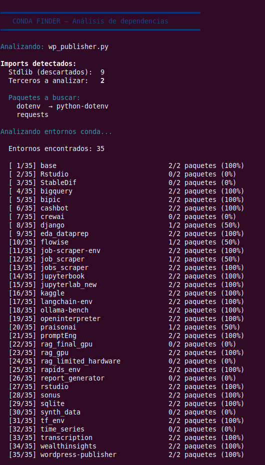
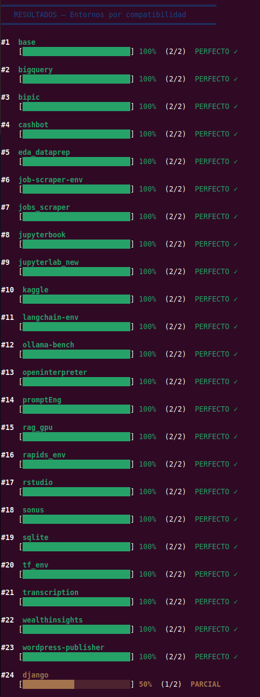
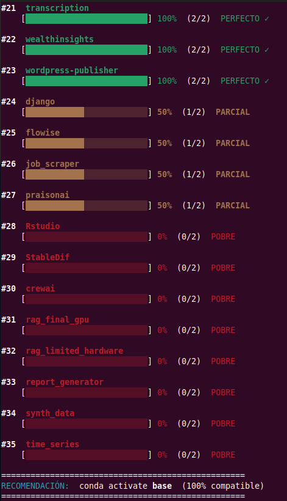

# conda_finder

**[English](#english) | [Español](#español)**

---

## English

### What is it?

`conda_finder` analyzes the imports of a Python script (or an entire project directory) and recommends which of your local conda environments is the best fit to run it — without having to activate each environment manually.

It works by:
1. Parsing imports using Python's AST (reliable, not grep-based)
2. Filtering out standard library modules automatically
3. Mapping import names to real package names (`sklearn` → `scikit-learn`, `PIL` → `pillow`, etc.)
4. Checking all your conda environments without activating them (`conda list -n`)
5. Ranking results by compatibility percentage

---

### Requirements

- `bash`
- `python3` (with `ast` module — included in stdlib)
- `conda` available in `PATH`

---

### How to run it

`conda_finder.sh` is a **bash script**, not a Python script. Do not run it with `python`. Use one of these methods:

```bash
# Option 1: explicit bash (recommended)
bash conda_finder.sh my_script.py

# Option 2: directly (requires execute permission)
chmod +x conda_finder.sh
./conda_finder.sh my_script.py

# Option 3: full path
bash /home/ion/dev/github/bash_tools/conda_tools/conda_finder/conda_finder.sh my_script.py
```

> **Common mistake:** running it with `python conda_finder.sh` will fail with a syntax error because Python tries to parse bash code.

---

### Usage

```bash
bash conda_finder.sh <file.py | directory/> [OPTIONS]
```

#### Options

| Option | Description |
|--------|-------------|
| `--top N` | Show only the top N environments |
| `--detail` | Show which packages were found and which are missing |
| `-h`, `--help` | Show help message |

---

### Examples

```bash
# Analyze a single script
bash conda_finder.sh my_script.py

# Analyze an entire project directory
bash conda_finder.sh ~/projects/my_project/

# Show only the top 3 environments
bash conda_finder.sh analysis.py --top 3

# Show detailed package breakdown
bash conda_finder.sh model_training.py --detail

# Combine options
bash conda_finder.sh ~/projects/nlp_app/ --top 5 --detail
```

---

### Sample output

**Step 1 — Import analysis and environment scan:**



**Step 2 — Results ranked by compatibility:**



**Step 3 — Full ranking and final recommendation:**



---

### Import → Package name mapping

The script automatically maps import names to their real conda/pip package names. Some examples:

| Import name | Package name |
|-------------|--------------|
| `sklearn` | `scikit-learn` |
| `PIL` | `pillow` |
| `cv2` | `opencv` |
| `bs4` | `beautifulsoup4` |
| `yaml` | `pyyaml` |
| `dotenv` | `python-dotenv` |
| `skimage` | `scikit-image` |
| `fitz` | `pymupdf` |
| `git` | `gitpython` |
| `serial` | `pyserial` |

> Packages not in the mapping are searched using their import name directly.

---

### Compatibility rating

| Score | Label |
|-------|-------|
| 100% | PERFECT ✓ |
| 75–99% | VERY GOOD |
| 50–74% | PARTIAL |
| 25–49% | LOW |
| 0–24% | POOR |

---

### Notes

- Environments are checked **without activating** them, using `conda list -n <env>`. This is significantly faster than activating each one.
- Standard library modules (e.g. `os`, `sys`, `json`, `re`, `datetime`) are excluded from the analysis automatically.
- When analyzing a directory, all `.py` files found recursively are included.
- The script performs **prefix matching** for package names (e.g. `faiss-cpu` matches `faiss`), which reduces false negatives.

---

---

## Español

### ¿Qué es?

`conda_finder` analiza los imports de un script Python (o de un directorio de proyecto completo) y recomienda cuál de tus entornos conda locales es el más adecuado para ejecutarlo, sin necesidad de activar cada entorno manualmente.

El proceso es:
1. Extrae los imports usando el AST de Python (fiable, sin grep)
2. Filtra automáticamente los módulos de la biblioteca estándar
3. Mapea nombres de import a nombres reales de paquete (`sklearn` → `scikit-learn`, `PIL` → `pillow`, etc.)
4. Comprueba todos tus entornos conda sin activarlos (`conda list -n`)
5. Ordena los resultados por porcentaje de compatibilidad

---

### Requisitos

- `bash`
- `python3` (con el módulo `ast` — incluido en la stdlib)
- `conda` disponible en el `PATH`

---

### Cómo ejecutarlo

`conda_finder.sh` es un **script de bash**, no un script de Python. No lo ejecutes con `python`. Usa una de estas formas:

```bash
# Opción 1: bash explícito (recomendado)
bash conda_finder.sh mi_script.py

# Opción 2: directamente (requiere permisos de ejecución)
chmod +x conda_finder.sh
./conda_finder.sh mi_script.py

# Opción 3: ruta completa
bash /home/ion/dev/github/bash_tools/conda_tools/conda_finder/conda_finder.sh mi_script.py
```

> **Error frecuente:** ejecutarlo con `python conda_finder.sh` falla con un error de sintaxis porque Python intenta interpretar código bash como si fuera Python.

---

### Uso

```bash
bash conda_finder.sh <archivo.py | directorio/> [OPCIONES]
```

#### Opciones

| Opción | Descripción |
|--------|-------------|
| `--top N` | Mostrar solo los N mejores entornos |
| `--detail` | Mostrar qué paquetes se encontraron y cuáles faltan |
| `-h`, `--help` | Mostrar ayuda |

---

### Ejemplos

```bash
# Analizar un único script
bash conda_finder.sh mi_script.py

# Analizar un directorio de proyecto completo
bash conda_finder.sh ~/proyectos/mi_proyecto/

# Mostrar solo los 3 mejores entornos
bash conda_finder.sh analisis.py --top 3

# Ver detalle de paquetes encontrados y faltantes
bash conda_finder.sh entrenamiento_modelo.py --detail

# Combinar opciones
bash conda_finder.sh ~/proyectos/app_nlp/ --top 5 --detail
```

---

### Ejemplo de salida

**Paso 1 — Análisis de imports y escaneo de entornos:**


**Paso 2 — Resultados ordenados por compatibilidad:**


**Paso 3 — Ranking completo y recomendación final:**


---

### Mapeo import → nombre de paquete

El script traduce automáticamente los nombres de import a los nombres reales de paquete en conda/pip. Algunos ejemplos:

| Nombre del import | Nombre del paquete |
|-------------------|--------------------|
| `sklearn` | `scikit-learn` |
| `PIL` | `pillow` |
| `cv2` | `opencv` |
| `bs4` | `beautifulsoup4` |
| `yaml` | `pyyaml` |
| `dotenv` | `python-dotenv` |
| `skimage` | `scikit-image` |
| `fitz` | `pymupdf` |
| `git` | `gitpython` |
| `serial` | `pyserial` |

> Los paquetes que no están en el mapeo se buscan directamente con su nombre de import.

---

### Escala de compatibilidad

| Puntuación | Etiqueta |
|------------|----------|
| 100% | PERFECTO ✓ |
| 75–99% | MUY BUENO |
| 50–74% | PARCIAL |
| 25–49% | BAJO |
| 0–24% | POBRE |

---

### Notas

- Los entornos se comprueban **sin activarlos**, usando `conda list -n <env>`. Esto es considerablemente más rápido que activar cada entorno.
- Los módulos de la biblioteca estándar (`os`, `sys`, `json`, `re`, `datetime`, etc.) se excluyen del análisis automáticamente.
- Al analizar un directorio, se incluyen todos los archivos `.py` encontrados de forma recursiva.
- El script usa **coincidencia por prefijo** en los nombres de paquete (por ejemplo, `faiss-cpu` coincide con `faiss`), lo que reduce los falsos negativos.
