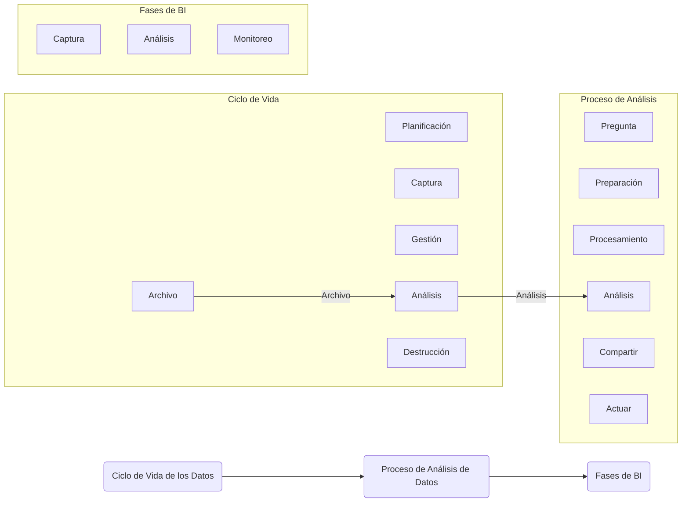

<think>
Okay, so the user has given me a query where they want to convert some technical notes into an educational and engaging article. They provided a table comparing the data lifecycle with BI phases and included a Mermaid flowchart. There's also a section explaining why correcting the order is important.

First, I need to understand what exactly they're asking for. They mentioned that they're a technical writer specializing in data science and machine learning. So their goal is to make technical content more accessible and interesting. 

Looking at the table and the flowchart, it seems like there was an error in the original ordering of phases. The user wants to fix this by moving the archiving step after analysis. That makes sense because you don't want to archive data before extracting value from it.

I should start by outlining the key points: the comparison between data lifecycle and BI phases, the issues with the original order, and the reasons why the correction matters. The Mermaid diagram is a visual aid that I can reference to structure the article properly.

The user also provided some bullet points on importance, like logical flow, storage optimization, compliance, etc. These should be highlighted in the article to emphasize the benefits of the corrected process.

I need to make sure the article flows naturally. Maybe start with an introduction explaining why data lifecycle matters, then move into comparing each phase, and finally discuss why the correction is crucial. Including real-world examples or analogies could help make it more relatable.

I should also keep the language clear and engaging. Avoiding jargon where possible and explaining terms when necessary will make it accessible to a broader audience. Using headings and subheadings can break up the text and make it easier to read.

The user ended with an invitation for deeper discussion, so perhaps in the conclusion, I can hint at future topics or invite readers to engage further. This adds value and encourages interaction.

I need to ensure that each section transitions smoothly into the next. Starting with planning and capture, then moving through management and analysis, and finally archiving and destruction, while showing how BI phases fit within this framework.

Including the Mermaid diagram as an image would be helpful, but since it's text-based, I'll describe it in a way that's clear without needing to visualize it. Maybe using bullet points or a numbered list where appropriate.

Overall, the key is to present complex information in a digestible format, making sure each part of the process is understandable and the importance of each step is clear. By structuring the article logically and keeping the tone friendly yet informative, I can meet the user's goal effectively.
</think>

### El Ciclo de Vida de los Datos y las Fases de BI: Un Enfoque Óptimo para el Éxito en el Análisis

El manejo eficiente de los datos es esencial en cualquier proyecto relacionado con la ciencia de datos o el análisis de negocio inteligente (BI). Sin embargo, es fácil caer en errores que podrían comprometer la integridad y el valor de los datos. Uno de estos errores es el orden incorrecto en el que se sitúan las fases del **ciclo de vida de los datos** en relación con las **fases de BI**. En este artículo, analizaremos cómo corregir este error y por qué es importante.

---

### Comparación entre el Ciclo de Vida de los Datos y las Fases de BI

A continuación, presentamos una comparación detallada entre las fases del ciclo de vida de los datos y las fases de BI:

| **Ciclo de Vida de los Datos** | **Fases de BI**                     | **Observaciones**                                                                 |
|-------------------------------|--------------------------------------|----------------------------------------------------------------------------------|
| **Planificación y Captura**    | **Captura**                          | La planificación es importante en ambas, pero en BI la captura se centra en la integración de datos de múltiples fuentes.            |
| **Gestión y Análisis**        | **Análisis**                         | Ambos procesos involucran el análisis de datos, pero la gestión en el ciclo de vida incluye tareas como limpieza, transformación y almacenamiento. |
| **Archivo y Destrución**      | **Monitoreo**                        | El monitoreo en BI se centra en el rendimiento de los sistemas y la calidad de los datos, no necesariamente en su eliminación.           |

---

### Diagrama de Flujo: Un Vistazo al Proceso

El diagrama de flujo siguiente ilustra las relaciones clave entre el **ciclo de vida de los datos**, el **proceso de análisis** y las **fases de BI**:

---

### ¿Por qué es Importante esta Corrección?

La corrección del orden en el que se sitúan las fases tiene repercusiones significativas:

1. **Orden Lógico**:  
   Los datos deben ser analizados antes de archivarse. Si se archivan primero, se pierde la oportunidad de extraer valor de ellos.

2. **Optimización del Almacenamiento**:  
   Analizar los datos antes de archivarlos permite eliminar información redundante o innecesaria, optimizando el espacio de almacenamiento.

3. **Cumplimiento Normativo**:  
   En algunos casos, existen regulaciones que establecen plazos máximos para conservar los datos. Analizar primero garantiza que solo se archiven aquellos datos que sean realmente necesarios.

---

### Conclusión

El orden correcto en el que se sitúan las fases del **ciclo de vida de los datos** y las **fases de BI** es fundamental para asegurar la calidad, integridad y valor de los datos. La planificación, captura, gestión, análisis, archivo y destrucción deben realizarse en un orden lógico que permita extraer el máximo provecho de los datos.

Si bien la corrección de este error puede parecer sutil, su impacto en el resultado final de los proyectos de análisis es significativo. Por lo tanto, es esencial comprender y aplicar estas fases correctamente para alcanzar el éxito en cualquier proyecto relacionado con la ciencia de datos o el BI.

--- 

¿Te interesa saber más sobre este tema? ¿Has enfrentado desafíos similares en tus proyectos? ¡Comenta abajo! 😊