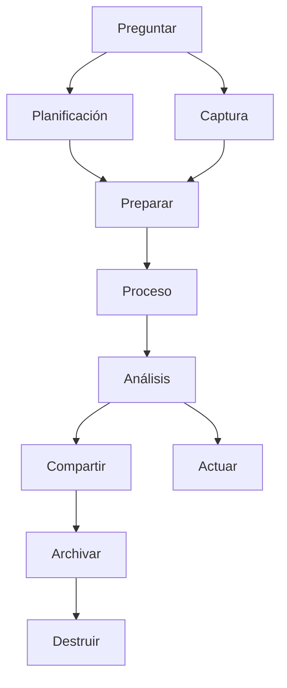

<think>
Okay, so the user wants me to convert a technical note into an enjoyable and educational article. They provided some Mermaid code that shows how data analysis phases overlap with the data lifecycle stages. Hmm, I need to make this clear for someone who might not be familiar with these concepts.

First, I should start by introducing what the diagram represents. Maybe call it "The Symphony of Data: Understanding the Lifecycle and Analysis Phases." That sounds catchy and musical, which is more engaging.

I need to explain each part step by step. Let's break down the lifecycle stages and analysis phases separately before showing how they connect. I'll use simple terms so it's accessible. For example, instead of "Planificación," I can say "Planning."

Then, I should show the connections between them using the Mermaid diagram. Maybe explain each arrow as a bridge that shows how these parts work together. Using analogies might help, like comparing data to ingredients in a recipe.

I also want to highlight why this matters. By showing how proper data management leads to better decision-making and business goals, it adds value. Real-life examples would make it relatable.

Finally, wrap it up with a conclusion that ties everything together, emphasizing the harmony between planning and analysis. Maybe end on an encouraging note about being a data maestro.

I should keep each section short and use bullet points or lists where possible to make it easy to digest. The tone should be friendly and enthusiastic to make reading enjoyable.
</think>

# La sinfonía de los datos: entendiando el ciclo de vida y las fases del análisis

¿Has alguna vez intentado entender cómo se relacionan los datos con los objetivos de tu negocio? ¿O te preguntas cómo gestionar correctamente la información para tomar decisiones informadas?

Si es así, estás en el lugar correcto. En este artículo, exploraremos una sencilla pero poderosa representación visual que muestra cómo las fases del análisis de datos se superponen y conectan con las etapas del ciclo de vida de los datos.

## Un diagrama esquemático: la base de nuestra comprensión

El diagrama siguiente, creado en el lenguaje **Mermaid**, ilustra claramente las relaciones entre estas dos importantes disciplinas:

## Decodificando el diagrama

Vamos a desglosar cada parte del diagrama para entender mejor su significado:

### 1. **Las fases del análisis de datos**
Estas son las etapas que seguimos para extraer insights y valor de los datos:
- **Preguntar (A):** Comenzamos con una pregunta o objetivo específico.
- **Preparar (D):** Preparamos los datos para su uso.
- **Proceso (E):** Procesamos los datos para su análisis.
- **Análisis (F):** Analizamos los datos para extraer información valiosa.
- **Compartir (G):** Compartimos los resultados con los interesados.
- **Actuar (J):** Utilizamos los insights para tomar decisiones o actuar.

### 2. **Las etapas del ciclo de vida de los datos**
Estas son las fases naturales que atraviesan los datos desde su creación hasta su eliminación:
- **Planificación (B):** Definimos cómo vamos a recolectar y gestionar los datos.
- **Captura (C):** Recolectamos los datos.
- **Preparar (D):** Preparamos los datos para su uso.
- **Proceso (E):** Procesamos los datos.
- **Compartir (G):** Compartimos los datos con otros sistemas o personas.
- **Archivar (H):** Archivamos los datos para futuros usos.
- **Destruir (I):** Eliminamos los datos cuando ya no son necesarios.

## ¿Cómo se conectan?

El diagrama muestra cómo estas dos disciplinas se entrelazan:

- La fase de **Preguntar** del análisis está relacionada con la etapa de **Planificación** del ciclo de vida. Esto significa que, antes de empezar a trabajar con los datos, debemos planificar bien.
  
- La fase de **Preparar** en el análisis se conecta con las etapas de **Captura** y **Preparar** del ciclo de vida. Es decir, la preparación de los datos es un proceso que comienza con su captura y termina con su procesamiento.

- El **Proceso** y el **Análisis** del dato están estrechamente ligados, ya que el procesamiento es una etapa previa necesaria para realizar un análisis eficiente.

- La fase de **Compartir** en ambos flujos se une, lo que subraya la importancia de compartir los resultados de manera efectiva.

- Por último, la fase de **Actuar**, que surge del análisis, conecta con las etapas de **Archivar** y **Destruir**, recordándonos que los datos tienen un ciclo de vida completo, desde su creación hasta su eliminación.

## ¿Por qué es importante esta conexión?

La comprensión de cómo se relacionan el análisis de datos y el ciclo de vida de los datos es clave para gestionar la información de manera efectiva. Al entender estas conexiones, podemos:
- Tomar decisiones más informadas.
- Optimizar procesos.
- Mejorar la eficiencia en la gestión de datos.

En definitiva, este diagrama no solo ilustra las relaciones entre el análisis y el ciclo de vida de los datos, sino que también nos recuerda la importancia de planificar, gestionar y proteger nuestros datos desde su origen hasta su fin.

## Conclusión: Ser un maestro de los datos

Gestionar los datos correctamente no es solo una tarea técnica; es una disciplina que requiere comprensión, planificación y cuidado. Al entender cómo se entrelazan el análisis y el ciclo de vida de los datos, podemos convertirnos en verdaderos "maestros de los datos", capaces de extraer valor, tomar decisiones informadas y alcanzar los objetivos comerciales.

Así que la próxima vez que trabajes con datos, recuerda este diagrama y las conexiones que representa. Con esta perspectiva, podrás ver el mundo de los datos no como un laberinto complicado, sino como una sinfonía de etapas y fases que, bien gestionadas, pueden llevarte al éxito.