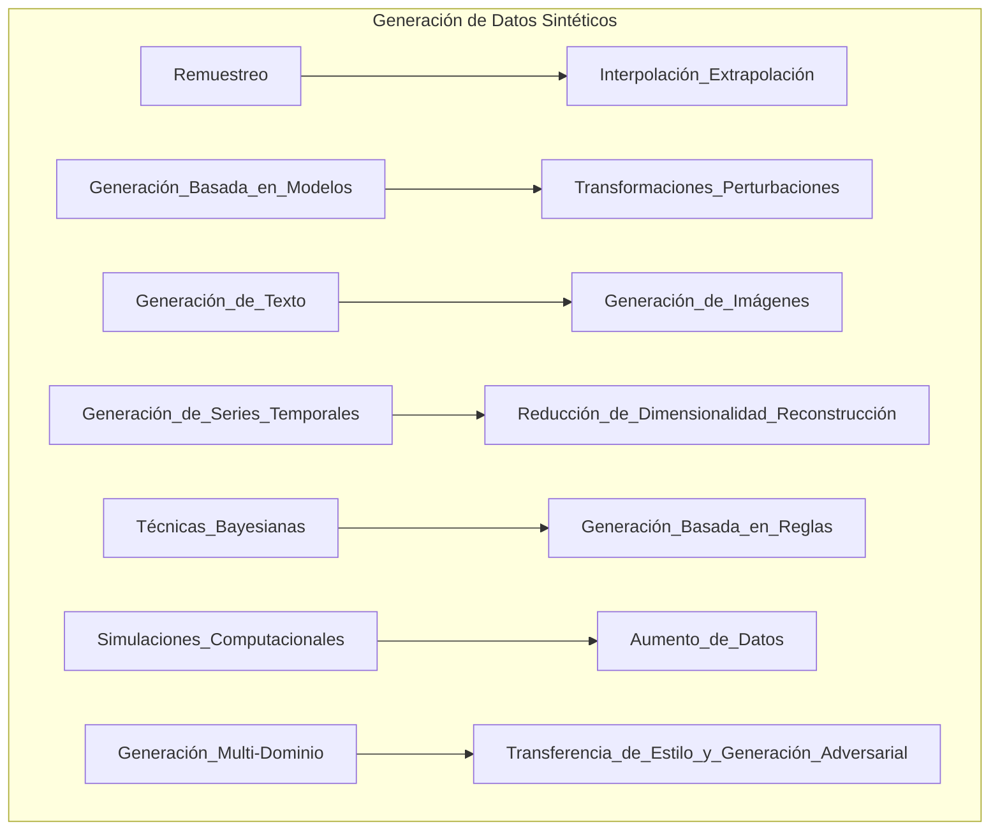

<think>
Alright, I need to help the user convert a technical note into an engaging article. The content is about synthetic data generation approaches using Mermaid diagrams. 

First, I'll start by understanding the structure of the diagram provided. It shows various techniques under "Generación de Datos Sintéticos" with different methods connected to each other.

I should break down each technique and explain them in simple terms. Maybe use headings for each approach and give examples so it's relatable. 

I need to make sure the language is clear and educational, avoiding jargon as much as possible. Also, keep it engaging by using conversational tones and maybe some analogies.

The user might be looking to understand these techniques without a deep technical background, so I'll focus on explaining each method's purpose and how they connect in the bigger picture of data generation.

I should also highlight why synthetic data is important, especially for those dealing with scarce datasets. This adds context and shows the value of understanding these methods.

Finally, wrap it up by summarizing the relationships between the techniques and emphasize the importance of context in applying them effectively.
</think>

**La Generación de Datos Sintéticos: Un Enfoque Integral**

En el mundo de la ciencia de datos y el machine learning, los datos son el combustible que alimenta las innovaciones. Sin embargo, no siempre contamos con suficientes datos para entrenar nuestros modelos o para probar nuestras hipótesis. Es aquí donde entra en juego la **generación de datos sintéticos**, una técnica cada vez más importante que nos permite crear información artificialmente pero útil para resolver problemas complejos.

En este artículo, exploraremos diferentes enfoques y técnicas utilizadas en la generación de datos sintéticos, mostrando cómo se relacionan entre sí a través de un diagrama de relaciones. Si bien algunos métodos son independientes, otros se entrelazan de manera compleja, dependiendo del contexto en el que se apliquen.

---

### **Generación de Datos Sintéticos: Un Diagrama de Relaciones**

El diagrama siguiente ilustra una red de conexiones entre los diferentes enfoques y técnicas utilizadas en la generación de datos sintéticos:

### **Entendiendo los Enfoques**

1. **Remuestreo (Resampling)**
   - Es una técnica simple que consiste en crear nuevos conjuntos de datos a partir de los existentes, sin modificar los datos originales.
   - Ejemplo: Realizar muestreos con reemplazo (bootstrap) o sin reemplazo.

2. **Interpolación y Extrapolación**
   - Son técnicas estrechamente relacionadas con la creación de valores nuevos basados en datos existentes.
   - Interpolación: Predecir valores dentro del rango de los datos observados.
   - Extrapolación: Predecir valores fuera del rango de los datos observados.

3. **Generación Basada en Modelos (Model-Based Generation)**
   - Se centra en el uso de modelos estadísticos o matemáticos para crear datos sintéticos que sigan un patrón específico.
   - Ejemplo: Uso de distribuciones probabilísticas como la normal multivariante.

4. **Transformaciones y Perturbaciones (Transformations and Perturbations)**
   - Involucran modificar ligeramente los datos existentes para crear variantes nuevas.
   - Ejemplo: Añadir ruido gaussiano a una variable o realizar transformaciones afines en imágenes.

5. **Generación de Texto y de Imágenes**
   - Son aplicaciones específicas de la generación de datos sintéticos, donde los modelos (como GANs o transformers) aprenden a crear texto o imágenes nuevas.
   - Ejemplo: Uso de LLMs para generar textos coherentes o deGANs para crear imágenes realistas.

6. **Generación de Series Temporales**
   - Se enfoca en la creación de datos temporales, como series de tiempo, utilizando métodos estadísticos o recurrentes.
   - Ejemplo: Pronóstico meteorológico basado en series temporales.

7. **Reducción de Dimensionalidad y Reconstrucción**
   - Consiste en reducir el tamaño del dataset y luego intentar reconstruirlo, lo que puede ayudar a identificar patrones ocultos.
   - Ejemplo: Uso de PCA (Análisis de Componentes Principales) para reducir dimensiones.

8. **Técnicas Bayesianas**
   - Utilizan la inferencia bayesiana para modelar incertidumbre y generar datos sintéticos que reflejen esta incertidumbre.
   - Ejemplo: Modelos Bayesianos en medicina para estimar probabilidades de enfermedad.

9. **Simulaciones Computacionales**
   - Son usadas en campos como la física, las finanzas o la biología para simular fenómenos complejos.
   - Ejemplo: Simulación de flujo de tráfico vehicular.

10. **Aumento de Datos (Data Augmentation)**
    - Consiste en crear variantes de los datos existentes para ampliar el conjunto de entrenamiento.
    - Ejemplo: Rotar o espelejar imágenes en Deep Learning.

11. **Generación Multi-Dominio y Transferencia de Estilo**
    - Se enfocan en combinar información de múltiples dominios o estilos para crear datos sintéticos innovadores.
    - Ejemplo: Generar imágenes que combinen características de dos dominios diferentes.

12. **Generación Adversarial (Adversarial Generation)**
    - Utiliza juegos de suma cero entre dos modelos (generador y discriminador) para crear datos sintéticos realistas.
    - Ejemplo: Uso de GANs en el arte digital.

---

### **Cómo Se Relacionan los Enfoques**

El diagrama muestra cómo estos enfoques se interconectan:

- La **generación basada en modelos** puede integrarse con **transformaciones y perturbaciones** para crear datos más realistas.
- Las **simulaciones computacionales** pueden utilizarse para **aumentar los datos** en contextos donde los datos son raros.
- La **generación de series temporales** se entrelaza con la **reducción de dimensionalidad y reconstrucción**, permitiendo identificar patrones escondidos en datos complejos.

Es importante recordar que las relaciones entre estos enfoques no siempre son directas. Dependiendo del problema específico, algunos métodos pueden ser más efectivos que otros.

---

### **Por Qué Es Útil la Generación de Datos Sintéticos**

La generación de datos sintéticos es especialmente útil en situaciones donde los datos reales son difíciles de obtener o insuficientes. Algunas aplicaciones comunes incluyen:

- **Aumento de datos**: Para entrenar modelos con más información.
- **Validación de hipótesis**: Para probar teorías sin acceder a datos sensibles.
- **Pruebas en entornos seguros**: Para simular escenarios complejos sin riesgos.

---

### **Conclusión**

La generación de datos sintéticos es un campo vasto y versátil que ofrece herramientas poderosas para los científicos de datos y los profesionales de machine learning. Al entender cómo se relacionan los diferentes enfoques, podemos elegir las técnicas más adecuadas para cada problema, asegurando así el éxito de nuestros proyectos.

¿Te gustaría explorar某 spécifique aspecto de la generación de datos sintéticos? ¡Hágalo saber!