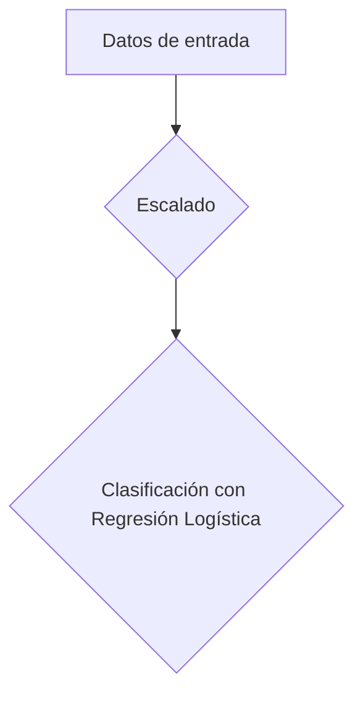

<think>
Vale, el usuario me ha preguntado sobre lo que es un pipeline en Scikit-learn. Me dijo que le parece una lista de funciones y quiso saber si está en lo correcto.

Primero, le confirmé que está en lo cierto al compararlo con una lista de funciones, pero quise aclarar más cómo funciona internamente.

Expliqué que un pipeline es una secuencia ordenada de pasos, cada uno compuesto por un nombre y un estimador o transformador. Usando un ejemplo concreto, mostré cómo se define un pipeline con dos etapas: escalado y clasificación.

Luego, quise refinar su comprensión señalando que aunque parece una lista de funciones, el pipeline maneja secuencialmente los datos pasados de un paso a otro, lo cual evita errores comunes y simplifica el código.

Para ayudarle a visualizar, dibujé un diagrama gráfico en lenguaje Mermaid que muestra cómo fluyen los datos a través de cada etapa del pipeline: transformador 1, transformador 2 y estimador final.

Finalmente, resalté las ventajas clave de usar pipelines, como la eliminación de errores comunes, el código más limpio y la reutilización sencilla.
</think>

¡Claro! Un_pipeline en `scikit-learn` es una secuencia ordenada de pasos que procesan los datos para entrenar un modelo. Cada paso puede ser una transformación (como escalado o codificación) o un estimador final (el modelo que hace predicciones). 

**¿Por qué usar un pipeline?**

1. **Organización del código:** Agrupa todo el flujo de trabajo en un solo objeto, haciéndolo más limpio y fácil de entender.

2. **Aplicación automática de transformaciones:** Aplica todas las transformaciones necesarias en orden, sin tener que hacerlo manualmente en cada paso.

3. **Evita errores comunes:** Protege contra prácticas dañinas, como usar datos de prueba para la transformación, ayudando a mantener el conjunto de validación intacto.

4. **Reutilización del código:** Facilita compartir y reutilizar flujos de trabajo entre proyectos.

**Estructura básica de un pipeline:**

```python
from sklearn.pipeline import Pipeline
from sklearn.preprocessing import StandardScaler
from sklearn.linear_model import LogisticRegression

# Definir el pipeline con dos etapas:
# 1. Escalado de características
# 2. Clasificación usando Regresión Logística
pipeline = Pipeline([
    ('escalar', StandardScaler()),
    ('clasificar', LogisticRegression())
])

# Entrenar el modelo
pipeline.fit(X_train, y_train)

# Hacer predicciones
predicciones = pipeline.predict(X_test)
```

**Diagrama gráfico del flujo:**



Cada paso transforma los datos y pasa el resultado al siguiente paso, culminando con el modelo entrenado.

**Ventajas clave:**

- **Menos código:** Reduce la necesidad de bucles anidados para aplicar transformaciones.
- **Menos errores:** Automatiza el flujo, evitando que los datos se mezclen o contaminen.
- **Mejor mantenibilidad:** Facilita aggiornare o modificar el flujo sin alterar todo el código.

En resumen, un pipeline en `scikit-learn` es una herramienta poderosa para construir flujos de trabajo eficientes y reproducibles, ayudando a los científicos de datos a enfocarse en resolver problemas complejos en lugar de en la infraestructura necesaria.