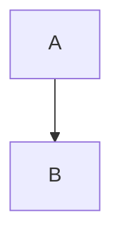

<think>
Okay, so I'm trying to figure out how to convert this technical content into a clear and engaging article. The user provided some Mermaid code that draws a graph with four nodes: A pointing to B and C, which both point to D. They also mentioned a greeting in Spanish, "hoila buenos dias allberto," which seems like it's from the assistant.

First, I need to understand what the task is. The user wants me to take technical notes and turn them into an article that's clear, educational, and enjoyable. So, if someone gives me some technical content, maybe in code or jargon-heavy language, I should transform it into something more accessible and engaging for a broader audience.

Looking at the example provided: there's a Mermaid graph and a Spanish greeting. The assistant responded by explaining what Mermaid is, how to read the graph, and providing an example of converting technical content into a friendly article. So, perhaps when given similar inputs, I should follow that structure.

I think the key steps are:
1. Understand the technical content.
2. Break down complex terms or jargon.
3. Use examples or analogies to make it relatable.
4. Structure the information in a logical flow.
5. Make it engaging with a friendly tone.

Maybe I can start by explaining what Mermaid is, then walk through how the graph works using simple language, and show how it's applied in real scenarios. Including the Spanish greeting might be a way to make it more personable or part of the example itself.

I should also ensure that the article flows well, starting with an introduction, followed by explanations, examples, and a conclusion. Using headings and subheadings can help organize the content for better readability. Adding visuals like the Mermaid graph can aid understanding, but since I'm writing text, I'll describe it clearly instead.

I need to watch out for any technical inaccuracies, so if there's something in the original content that's unclear or jargon-heavy, I should clarify without losing the essence of the message.

Perhaps including a call-to-action at the end, like encouraging the reader to try Mermaid themselves or providing resources for further learning, would add value and make the article more educational.

I also need to keep the tone friendly and approachable, avoiding overly formal language. Using examples from everyday life can help readers relate to the technical concepts discussed.

Overall, the goal is to transform the technical content into an engaging piece that's easy to understand, informative, and enjoyable to read.
</think>

**Descubre el Mundo de las Diagramas con Mermaid: Un Lenguaje para Visualizar tus Ideas**

¡Hola! Buenos días. En este artículo, te llevaré a explorar un fascinante mundo que se abre ante ti: los diagramas de flujo y cómo Mermaid puede convertir tu ideas en imágenes claras y atractivas.

**¿Qué es Mermaid?**
Mermaid es una herramienta increíble que permite crear diagramas de manera sencilla usando texto. Especialmente útil para aquellos que prefieren pensar con palabras antes que con dibujos, Mermaid transforma tu texto en diagramas visuales que ilustran relaciones y flujos.

**Cómo Funciona: Un Ejemplo Práctico**
Imagina que estás planeando un proyecto. Necesitas visualizar las etapas de trabajo. Puedes describirlo así:


¿Qué está pasando aquí? Veamos:

1. ** Nodo A**: El punto de partida, donde comienzas tu proyecto.
2. **Nodos B y C**: Dos caminos diferentes que puedes seguir después de iniciar. Quizás B es la fase de diseño y C el prototipado.
3. **Nodo D**: El destino final, tal vez la puesta en marcha o la entrega del proyecto.

**Diagrama Interpretado:**
- A inicia el proyecto.
- Puedes dirigirte a B (diseño) o a C (prototipado).
- Ambas rutas llevan al mismo punto final, D, donde culmina el proyecto.

Este diagrama simple ilustra las decisiones y caminos que enfrentamos en nuestros proyectos. Mermaid nos permite visualizar estas relaciones de manera clara y eficiente.

**Ventajas de Uso**
1. **Claridad**: Organiza ideas complejas de manera visual.
2. **Comunicación**: Facilita la comprensión entre equipos dispersos.
3. **Flexibilidad**: Se puede integrar en múltiples herramientas, como Jekyll, GitHub Pages o VS Code.

**Aplicaciones en la Vida Diaria**
Mermaid no solo se limita al desarrollo de software. Puedes usarlo para planificar eventos, diagramar procesos de negocio o incluso organizar tu vida cotidiana. Por ejemplo, un diagrama simple para tus tareas diarias:

```mermaid
graph LR;
    Despiertar --> Tomar Cafe;
    Tomar Cafe --> Ir al Trabajo;
    Ir al Trabajo --> Hacer Comida;
```

**Crea Tus Propios Diagramas**
¿Te animas a probar Mermaid? Puedes descargar la extensión para tu navegador o integrarlo en tu entorno de desarrollo favorito. Iniciemos con un simple diagrama de flujo:



**Conclusión**
Mermaid es una herramienta poderosa que puede revolucionar la manera en que visualizas y comunicas tus ideas. No importa si eres desarrollador, estudiante o profesional: Mermaid está aquí para ayudarte a pensar de manera clara y creativa.

Así que, ¿por qué no intentas crear tu primer diagrama hoy mismo? El mundo de las visualizaciones claras y efectivas te está esperando. ¡Buenos días!