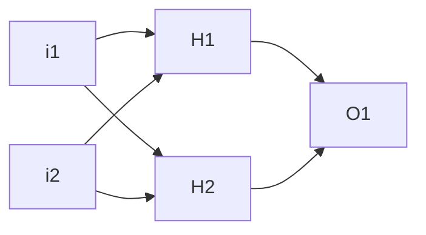
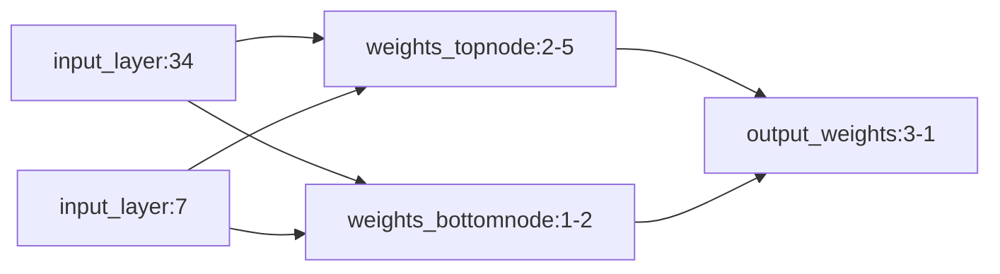
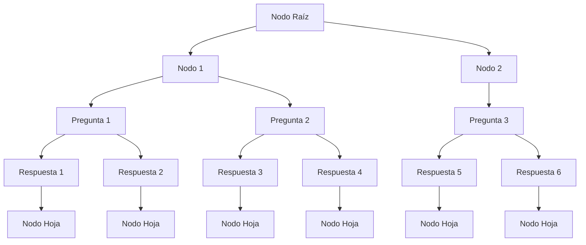

<think>
Vale, tengo que convertir estos diagramas de Mermaid en un artículo técnico claro y atractivo. Empezaré viendo cada diagrama por separado para entender qué representan.

El primer diagrama es una red neuronal simple con capas de entrada, oculta y salida. Veo que hay dos neuronas en la capa de entrada conectadas a dos neuronas en la capa oculta, y éstas a su vez conectadas a una neurona de salida. Esto es típico de un perceptrón multicapa, así que puedo explicar cómo funciona paso a paso.

El segundo diagrama también parece ser una red neuronal pero con conexiones específicas entre neuronas. Veo que hay dos neuronas en la capa de entrada conectadas a dos neuronas en otra capa, y éstas a una neurona final. Tal vez esto ilustra cómo las conexiones ponderadas contribuyen al aprendizaje, así que puedo hablar sobre los pesos yバイases.

El tercer diagrama es un árbol de decisión con bifurcaciones que representan preguntas y respuestas. Esto me recuerda a los modelos de machine learning basados en árboles, como Random Forest o Gradient Boosting. Puedo explicar cómo se construye el árbol y cómo se toman decisiones a partir de las preguntas.

Ahora, para estructurar el artículo: podría empezar con una introducción que explique qué es la ciencia de datos y el machine learning. Luego, dedicar una sección al primer diagrama, explicando las capas y neuronas. En otra sección, hablar sobre los pesos yバイases usando el segundo diagrama. Finalmente, tratar el árbol de decisión, detallando cómo funciona.

Me aseguraré de que cada explicación sea clara y accesible para principiantes, evitando términos técnicos complicados. Puedo incluir ejemplos sencillos, como clasificar flores o predecir precios de casas, para ilustrar los conceptos.

También quiero mantener el artículo entretenido, tal vez usando analogías y manteniendo un tono amistoso. Puede que incluya preguntas al final para incentivar la participación del lector.

Finalmente, revisaré todo para asegurarme de que esté bien estructurado, sin errores y que cada sección fluya naturalmente hacia la siguiente.
</think>

### Comprendiendo los Diagramas de Red Neuronal y Árboles de Decisión en Ciencia de Datos y Machine Learning

En el mundo de la ciencia de datos y el machine learning, visualizar los algoritmos puede ser una herramienta poderosa para comprender mejor cómo funcionan. A continuación, exploraremos dos diagramas que ilustran conceptos fundamentales: las redes neuronales y los árboles de decisión.

---

### Diagrama 1: Red Neuronial básica

El primer diagrama representa una red neuronal en su forma más simple:

**Descripción:**
- **Entrada (i1, i2):** Representan los datos de entrada que-fedimos a la red neuronal.
- **Capa Oculta (H1, H2):** Son neuronas intermedias que procesan las entradas para extraer características relevantes.
- **Salida (O1):** Es la neurona de salida que produce el resultado final de la red.

**Funcionamiento:**
1. Los datos de entrada (i1 y i2) se envían a las neuronas de la capa oculta (H1 y H2).
2. Las neuronas de la capa oculta procesan esta información y la transmiten a la neurona de salida (O1).
3. La neurona de salida produce el resultado final, que puede ser una clase o un valor continuo.

**Aplicación:**
Este tipo de estructura se usa en problemas de clasificación y regresión. Por ejemplo, podría utilizarse para predecir si una flor es de una especie determinada basada en sus medidas (longitud del pétalo y sépalo).

---

### Diagrama 2: Red Neuronial con Pesos

El segundo diagrama muestra cómo se asignan pesos a las conexiones entre neuronas:

**Descripción:**
- **Capa de Entrada (input_layer):** Tiene dos neuronas con valores 34 y 7.
- **Conexiones con Pesos:** Las neuronas de la capa oculta tienen pesos asignados, como 2-5 y 1-2.
- **Salida (output_weights):** La neurona final recibe conexiones ponderadas.

**Funcionamiento:**
1. Cada conexión entre neuronas tiene un peso asociado, que modula la influencia de una neurona en otra.
2. Los pesos se ajustan durante el entrenamiento para minimizar el error y mejorar las predicciones.

**Aplicación:**
Este concepto es fundamental en redes neuronales profundas, donde los pesos yバイases definen cómo las capas extraen información útil de los datos.

---

### Diagrama 3: Árbol de Decisión

El tercer diagrama ilustra un árbol de decisión:

**Descripción:**
- **Nodos Internos:** Representan preguntas o decisiones.
- **Conexiones:** Son las ramas que conducen de un nodo a otro.
- **Nodos Hojas:** Son las conclusiones o resultados finales.

**Funcionamiento:**
1. El árbol comienza en el nodo raíz y se despliega en una serie de preguntas (nodos internos).
2. Cada pregunta分支 en varias ramas, cada una representando una posible respuesta.
3. Las hojas son las conclusiones del modelo, que pueden ser clases o valores.

**Aplicación:**
Los árboles de decisión se usan para problemas de clasificación y regresión. Por ejemplo, podrían utilizarse para determinar si un cliente es apto para un préstamo basado en su historial crediticio.

---

### Conclusión

Visualizar los algoritmos de machine learning puede ser una herramienta invaluable para comprender mejor cómo funcionan. Los diagramas de redes neuronales y árboles de decisión nos ofrecen una representación gráfica que facilita el análisis y la interpretación de los modelos.

¿Te gustaría explorar más sobre cómo implementar estos conceptos en código?