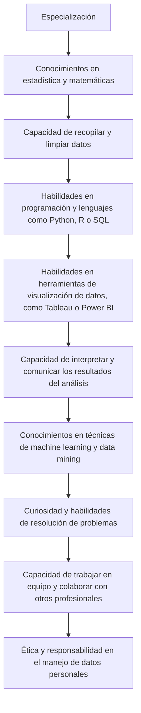
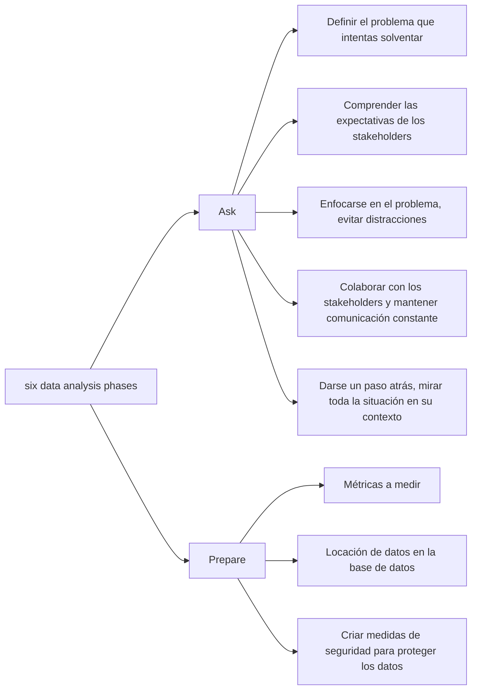

<think>
Alright, the user has asked me to convert some technical notes into a clear, educational, and enjoyable article. The content provided includes two Mermaid diagrams which outline key points related to data analysis and machine learning.

First, I need to understand what each diagram represents. The first one seems to detail the qualities or skills required for specializing in data science. It starts with Specialization and branches out into various technical skills like statistical knowledge, programming abilities, tool proficiency, etc., leading up to ethics and responsibility.

The second diagram appears to outline a process involving six phases of data analysis. It starts with "Ask" which includes understanding the problem, collaborating with stakeholders, defining metrics, locating data sources, creating security measures, and then preparing the data.

To convert these into an article, I should structure it in a way that's easy to follow. Maybe breaking it down into sections: one for the skills needed and another for the process phases. Using headings, subheadings, bullet points, and possibly numbering will help make it clear and engaging.

I'll start by introducing data science as an exciting field, highlighting how both technical know-how and soft skills are essential. Then, I'll detail each skill from the first diagram in a list format, explaining why each is important.

Next, for the process phases, I'll describe each phase with clear examples or analogies to make it relatable. For instance, comparing data analysis to detective work can make it more interesting.

I should also ensure that the language is simple and conversational, avoiding jargon unless necessary, and then explaining any technical terms when they're first introduced. Including practical applications or real-world scenarios could help illustrate the points effectively.

Finally, I'll wrap up with a conclusion that reinforces why these skills and processes are crucial in today's data-driven world, encouraging readers to pursue learning in these areas.
</think>

# El Mundo de los Datos: Una Guía para Principiantes

La ciencia de datos y el aprendizaje automático son disciplinas cada vez más importantes en nuestra sociedad. Pero, a menudo, se presentan como algo complejo y abrumador. En este artículo, te guiaré a través de los conceptos fundamentales y las habilidades necesarias para entender y trabajar con los datos.

---

## ¿Qué Se Necesita para Ser un Experto en Ciencia de Datos?

Para convertirse en un profesional de ciencia de datos o machine learning, es esencial desarrollar una combinación de habilidades técnicas y no técnicas. Aquí tienes un diagrama que muestra las habilidades clave:

### Detalles Clave:

1. **Conocimientos en estadística y matemáticas**: La estadística y las matemáticas son la base de la ciencia de los datos. Sin entender conceptos como las distribuciones probabilísticas o los algoritmos, no podrás avanzar.

2. **Recopilar y limpiar datos**: Los datos raramente llegan en un formato listo para analizar. Necesitarás habilidades para extraerlos de fuentes diversas y eliminar los errores o inconsistencias.

3. **Habilidades en programación**: Los lenguajes como Python, R o SQL son herramientas esenciales para manipular y analizar datos.

4. **Herramientas de visualización**: La capacidad de comunicar tus hallazgos a través de gráficos y tablas es crucial, especialmente si trabajas con equipos multidisciplinarios.

5. **Interpretación de resultados**: No basta con realizar análisis; debes entender lo que significan los resultados y comunicarlo de manera clara.

6. **Técnicas de machine learning**: Algoritmos como la regresión lineal, árboles de decisión o redes neuronales son fundamentales para construir modelos predictivos.

7. **Curiosidad e investigación**: La ciencia de datos es una disciplina curiosa, donde siempre hay preguntas nuevas y problemas por resolver.

8. **Colaboración**: Trabajar en equipo es fundamental, especialmente si estás en un entorno empresarial.

9. **Ética y responsabilidad**: Manejar datos personales conlleva responsabilidades éticas importantes.

---

## El Proceso de Análisis de Datos: Una Metodología para el Éxito

El siguiente diagrama ilustra los seis pasos clave en el proceso de análisis de datos:

### Detalles Clave:

1. **Ask (Preguntar)**:
   - Define el problema que quieres resolver.
   - Comprende las expectativas de los interesados (stakeholders).
   - Enfócate en el problema, evita distracciones.
   - Colabora con los stakeholders y mantén una comunicación constante.
   - Dete un paso atrás para analizar la situación global.

2. **Prepare (Preparar)**:
   - Define qué métricas quieres medir.
   - Localiza los datos en tu base de datos.
   - Crea medidas de seguridad para proteger los datos.

---

## Conclusión

La ciencia de datos y el aprendizaje automático son disciplinas apasionantes que requieren una combinación de habilidades técnicas y no técnicas. Desde la estadística hasta la ética, pasando por las herramientas de visualización y la programación, cada aspecto juega un papel crucial en el proceso de análisis.

Si estás empezando, no te preocupes por aprender todo a la vez. Empieza con los conceptos básicos, desarrolla tus habilidades y sigue siendo curioso. El mundo de los datos está lleno de oportunidades para aquellos que están dispuestos a explorarlo.